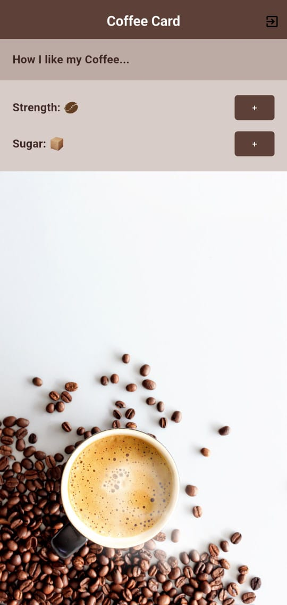

# ☕ Flutter Coffee Preferences App

An interactive Flutter app to visualize and customize how you like your coffee — from strength to sugar levels — with a stylish UI and responsive layout.

---

## 📱 Preview



---

## 🚀 Features

- 🌟 Adjust **coffee strength** (1–5 beans)
- 🍬 Customize **sugar level** (0–5 cubes)
- 🖼️ Visually reflects preferences using icons
- 🎨 Styled custom widgets (`StyledButton`, `StyledBodyText`)
- 📱 Clean and minimal UI with consistent design
- ✅ Exit button in the AppBar

---

## 🗂️ Project Structure

<pre> ```text lib/ ├── main.dart # App entry point ├── home.dart # Home screen layout ├── coffee_prefs.dart # Stateful widget for preferences └── styled_widget.dart # Reusable styled components assets/ ├── coffee_bg.jpg # Background image ├── coffee_bean.png # Coffee bean icon └── sugar_cube.png # Sugar cube icon ``` </pre>

---
